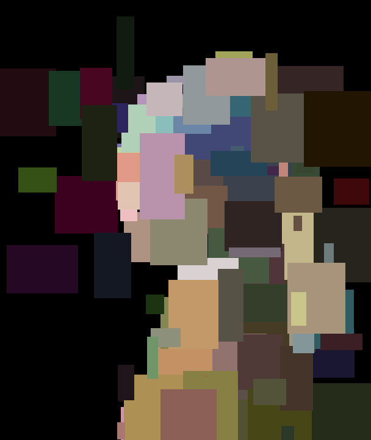
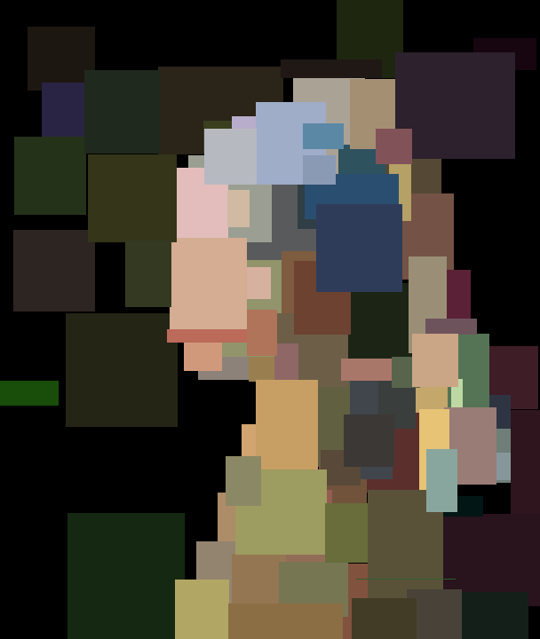
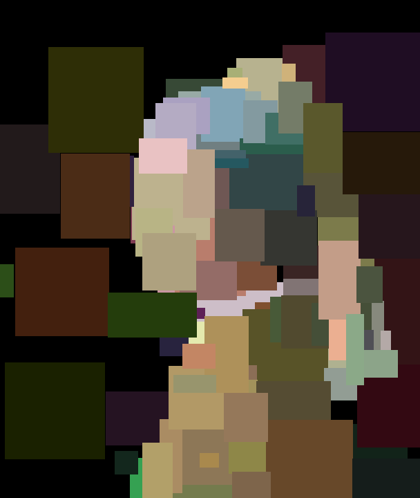
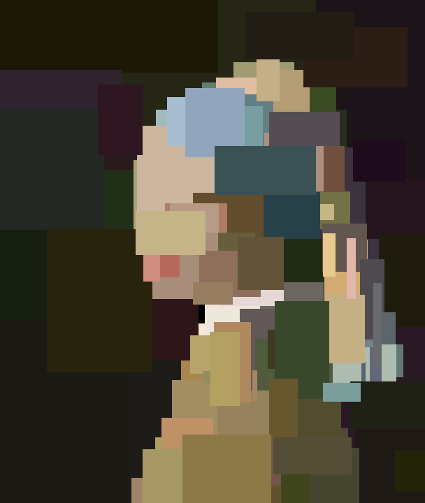
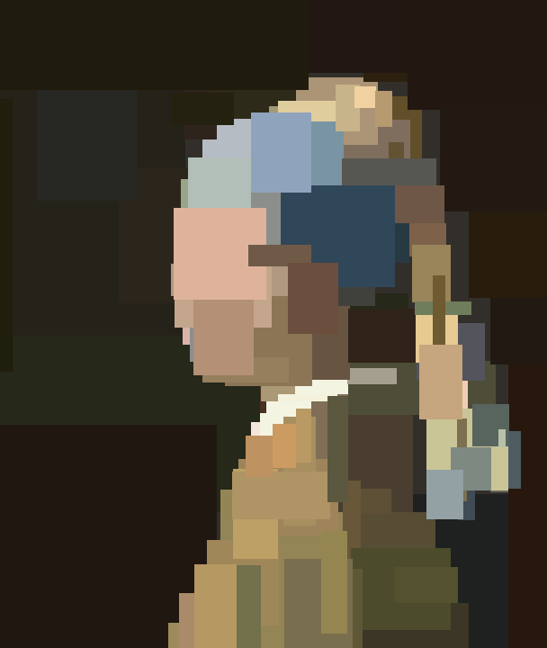
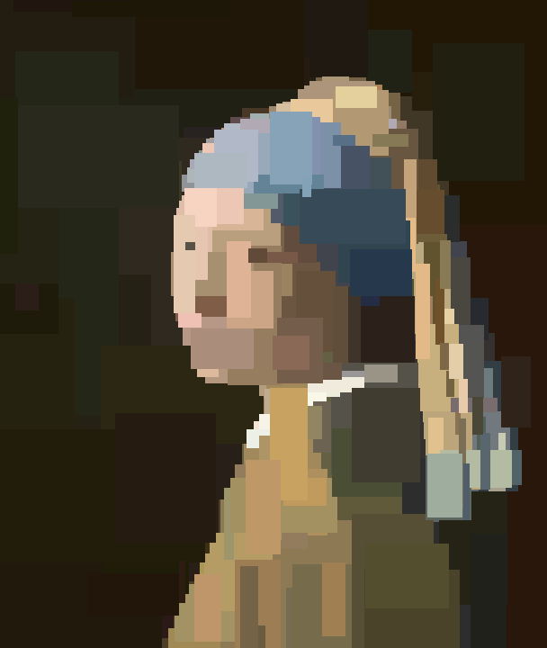
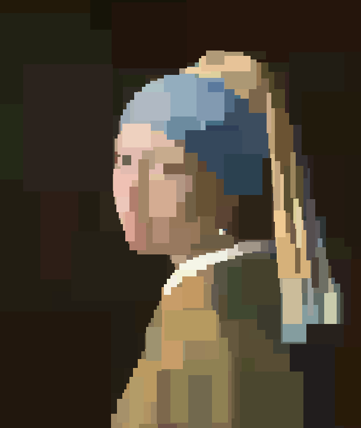
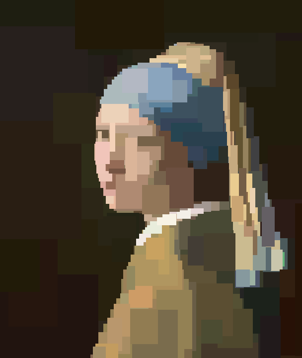
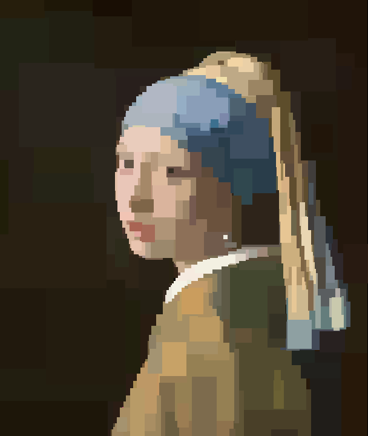
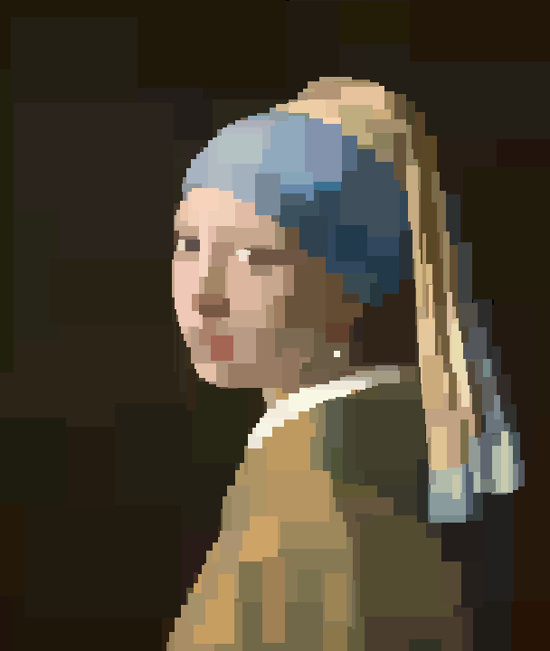

# Pale

Experiment project for testing out zig prior to doing some more serious development in it.

The goal for the project (except learning some zig) is to make a genetic algorithm that will try to mimic an image with some shape.

Ideally it will have a graphical progress tracker, and in the best of all worlds runnable in the browser.

## Notes

Because the project relies on raylib, and raylib in turn has some system deps, you will need to install those:

```
# apt update
# apt install libx11-dev libxext-dev libxrandr-dev libxinerama-dev libxcursor-dev libxi-dev libxfixes-dev libxrender-dev libgl1-mesa-dev libglu1-mesa-dev
```

## Progress

Part of this project will be optimizing the both the algorithm, but also the efficiency of evaluating the solutions, and the program as a whole.

The measurements are not going to be too precise, as they will be run on my computer locally, and not in some kind of reproducable environment. The problem is highly dependent on randomness, so a streak of favorable rolls can yield a much fitter solution.

To counter the fact that the evaluations are going to be run on my laptop locally, I will make sure to run the evaluation with the laptop plugged in, with performance mode enabled, and with only the single terminal open.

To counter the randomness factor I will re-run the process 10 times and take the mean of all the values.

Attempt | Avg. time run | Avg. iterations | Avg. iter/sec | Avg. normalized error | Result | Commit hash
--- | --- | --- | --- | --- | --- | ---
Naive mutations and evaluation | 60.03 s | 10567 | 176.1 | 0.08733 |  | [f2f32b3](https://github.com/ChocolateChipKookie/pale/commit/f2f32b3)
Same naive, but load all the pixels at once | 60.03 s | 15070 | 251.1 | 0.07870 |  | [48ea0fd](https://github.com/ChocolateChipKookie/pale/commit/48ea0fd)
Naive, but with rate limited frame rendering, meaning more time for evaluation | 60.01 s | 15871 | 264.4 | 0.07797 |  | [430aad8](https://github.com/ChocolateChipKookie/pale/commit/430aad8)
Evaluating only changed parts of the solution | 60.02 s | 53224 | 886.8 | 0.05114 |  | [18ae1a1](https://github.com/ChocolateChipKookie/pale/commit/18ae1a1)
Replace image.clearBackground with image.drawRectangle | 60.02 s | 561248 | 9351 | 0.04184 |  | [20af03e](https://github.com/ChocolateChipKookie/pale/commit/20af03e)
Remove upper bound for number of rects, and introduce deletion pressure | 60.02 s | 1022705 | 17040.34 | 0.03524 |  | [3c200c6](https://github.com/ChocolateChipKookie/pale/commit/3c200c6)
Add swap mutation | 60.02 s | 919213 | 15315 | 0.03478 |  | [fe4547e](https://github.com/ChocolateChipKookie/pale/commit/fe4547e)
Pull texture update out of busy loop | 60.02 s | 1058167 | 17631 | 0.03451 |  | [7a87185](https://github.com/ChocolateChipKookie/pale/commit/7a87185)
Introduce area downward pressure | 60.02 s | 3467283 | 57690 | 0.03134 |  | [2e99ee1](https://github.com/ChocolateChipKookie/pale/commit/2e99ee1)
Fix partial evaluation, and apply to evolution | 60.02 s | 3282308 | 54683 | 0.03107 |  | [cbc8c36](https://github.com/ChocolateChipKookie/pale/commit/cbc8c36)

NOTE: At some point (after the `Pull texture update out of busy loop`) I noticed that there is an issue with the partial evaluation I was doing (it was an one-off error). To rectify that I re-ran all of the previous runs, but at the end added a total re-evaluation of the best solution, and used the value that it gave (I did not fix the evaluator because that would possibly change the results too much, and I don't want to re-write history). To make it easier to navigate to the commit which the entry in the table is referencing, I will add a commit hash for each row (previously this could be done with git blame).
